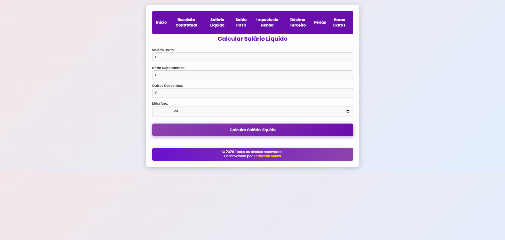
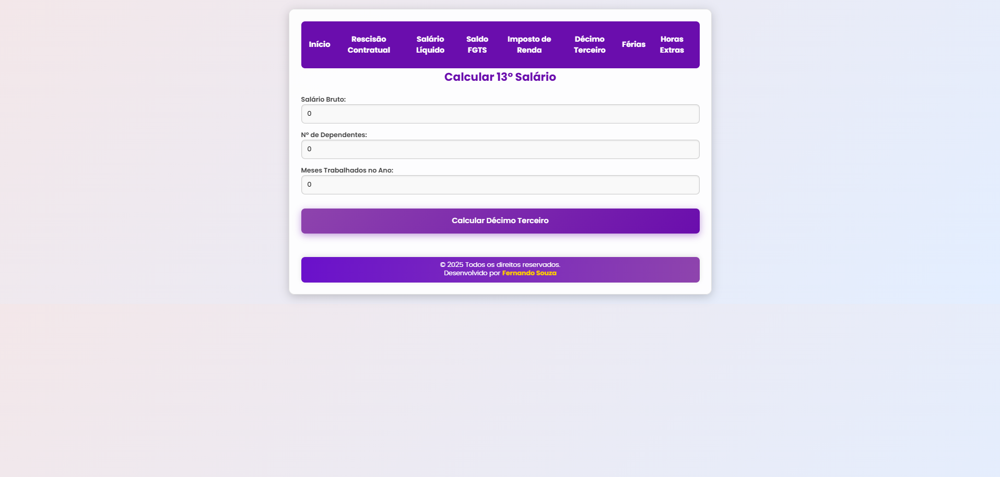

# Calculadora de Rescisão Trabalhista  

Esta é uma aplicação web desenvolvida em **React** que permite calcular a rescisão de um contrato de trabalho. O aplicativo se conecta a um banco de dados **MySQL** para armazenar e recuperar informações.  

## Tela da Aplicação  

### Home

### Tela Calculo Rescisão

### Tela Calculo Salário Líquido
 

### Tela Calculo Saldo FGTS

### Tela Calculo IRRF

### Tela Calculo Decimo Terceiro

### Tela Calculo Férias

### Tela Calculo Hora Extra

## Funcionalidades  

- Cálculo da rescisão trabalhista com base nas informações fornecidas pelo usuário.  
- Formulário para entradas como:  
  - Salário Bruto  
  - Data de Contratação  
  - Data de Demissão  
  - Motivo da dispensa  
  - Aviso prévio  
  - Férias vencidas  
- Cálculo Salário Líquido **Em Desenvolvimento**
- Cálculo Saldo FGTS **Em Desenvolvimento**
- Cálculo IRRF **Em Desenvolvimento**
- Cálculo Decimo Terceiro **Em Desenvolvimento**
- Cálculo Férias **Em Desenvolvimento**
- Cálculo Horas Extras **Em Desenvolvimento**
- Armazenamento e recuperação de dados usando MySQL.

## Tecnologias Utilizadas  

- **Frontend**: React  
- **Backend**: Node.js e Express  
- **Banco de Dados**: MySQL  

### Pré-requisitos  

Certifique-se de ter o Node.js e o MySQL instalados em sua máquina.

## Como Usar  